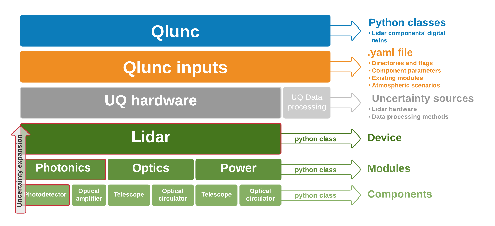

 ---
title: '``Qlunc``: Quantification of lidar uncertainty'
tags:
  - wind lidar
  - lidar hardware uncertainty
  - OpenScience
  - OpenLidar
  - digital twin

authors:
  - name: Francisco Costa
	orcid: 0000-0003-1318-9677
	affiliation: 1
  - name: Andrew Clifton
	orcid: 0000-0001-9698-5083
	affiliation: 1
  - name: Nikola Vasiljevic
	orcid: 0000-0002-9381-9693
	affiliation: 2
  - name: Ines Würth
	orcid: 0000-0002-1365-0243
	affiliation: 1
affiliations:
 - name: Stuttgart Wind Energy (SWE), Allmandring 5b, 70569 Stuttgart, Germany
   index: 1
 - name: DTU Wind Energy, Frederiksborgvej 399, 4000 Roskilde Denmark 
   index: 2
date: xx March 2021
bibliography: paper.bib
---
# Summary
Wind lidar measures the wind vector remotely using laser light backscattered from aerosols. They are a key tool for wind energy and meteorology. Like any measurement method, it is essential to estimate their uncertainty.
``Qlunc``, which stands for Quantification of lidar uncertainty, is an open-source python-based tool to create a digital twin of the lidar hardware, and estimate the uncertainty of wind lidar wind speed measurements.
``Qlunc`` contains models of the uncertainty contributed by individual lidar components and modules, that are then combined, considering their different nature, to estimate the uncertainties in wind lidar measurements. The modules are based on the OpenLidar architecture [@OpenLidar]. The terminology for the components and modules defined within Qlunc has also been aligned with a community-driven wind lidar ontology, which is in development [@OntoStack;@sheet2rdf]. 
The code is modular. This allows lidar components (represented by python objects) to be modified and swapped in a trackable way to allow adaptation of the tool for particular use-cases(see \autoref{fig:QluncStructure}).
Furthermore, ``Qlunc`` is designed to easily integrate different uncertainty methods or interfaces to external codes. It has an object-oriented structure taking advantage of python features; by using python objects that represent physical lidar components, the code articulates the lidar physical modules, thus resulting in a digital twin of the wind lidar. 
Besides uncertainty estimations, ``Qlunc``’s functions could be extended for other applications, for example to compare different  wind velocity vector calculation methods. This, combined with the underlying open-source code, defines an attractive scenario for sharing knowledge about wind lidars. 
``Qlunc`` provides a common, open-source platform that can be used to try many different uncertainty estimation methods, thus encouraging collaboration amongst the wind lidar community.
The source code for ``Qlunc`` [is available on Github](https://github.com/SWE-UniStuttgart/Qlunc) and the release associated with this paper has been archived to Zenodo( [@zenodo].
# Motivation
Wind lidars are measuring devices, and as for any other measuring systems, lidar measurements have uncertainties [@Borraccino_2016]. Therefore, as already stated, it is crucial to assess their measurements uncertainty, to increase confidence in lidar technology.
Measurement uncertainty means doubt about the validity of the result of a measurement [@GUM]. It represents the dispersion of the values attributed to a measurand. The ability to simulate uncertainty through a model such as ``Qlunc`` is important for judging measurement data but can also be useful for designing and setting up experiments and optimizing lidar design. Because wind lidar is important for wind energy applications [@Clifton_2018], better models for wind lidar hardware (e.g., ``Qlunc``) and measurement processes (e.g., through ``MOCALUM`` or ``YADDUM``, with which ``Qlunc`` can feasibly combine) will directly contribute to the adoption of wind lidar for wind energy applications. 
This project is influenced by fundamental open science principles [@OpenScience]. The scope is to create an open, standardized and collaborative framework to describe both generic and specific lidar architectures, characterize lidar uncertainties, and provide the tools for others to contribute within this framework. 
 
# ``Qlunc``’s capabilities
Wind lidars are flexible and versatile remote sensing devices for wind energy applications [@Hauke] that have also been customized for specific use cases, mainly through the choice of components and scanning patterns. Accordingly, ``Qlunc`` is flexible and will ultimately be able to simulate a lidar carrying out any kind of scanning pattern. The first release is focused on velocity azimuth display (VAD)[@Browning] scans and forward-looking nacelle-mounted measuring modes, which are common wind-energy-industry applications. 
For now, ``Qlunc``can compute wind lidar hardware uncertainties from the photonics module (including photodetector and optical amplifier components) and the optics module (including scanner pointing accuracy distance errors and optical circulator uncertainties). In the near future, uncertainties for other hardware components and lidar data processing methods will be implemented in the model.
``Qlunc`` generates several output plots. These show 1) the different signal noise contributors of the photodetector components and 2) estimates of the distance error between theoretical and measured points. Other output plots can be created by the user from the output data.
 

 
# Usage
The framework has been developed and tested using python 3.7. The programming environment required to use ``Qlunc`` is provided in the repository. 
There are two basic steps in using ``Qlunc``, which are described below. A more comprehensive  explanation of ``Qlunc``’s workflow can be found in the repository.
## Creating a lidar digital twin
As can be seen in [Figure 1](\autoref{fig:QluncStructure}) each lidar component is “built up” using python classes. Parameter values for the components are defined in a yaml file. 
## Uncertainty estimation model
Each component has associated an uncertainty function. The users can modify the uncertainty models by creating their own. 
The combined uncertainties of the  components and modules are then computed according to the Guide to the Expression of Uncertainty in Measurement (GUM) process [@GUM].
 
# Tutorials
There are  two Jupyter Notebooks-based tutorials in the [``Qlunc`` repository](https://github.com/SWE-UniStuttgart/Qlunc/tree/Qlunc-V0.9/Tutorials). The tutorials are also available through the Binder service to ease accessibility and reproducibility. 
Users can find more information about these tutorials in the *readme.md* file attached to the ``Qlunc`` repository.
``Qlunc``’s repository also includes a functional working example. More information about this working example is given in *Qlunc/TestFilesQlunc/readme.md*, where the process of creating a lidar digital twin is explained in depth.
 
# Future development roadmap
Over the next year, we plan to implement further lidar hardware modules in the model and compute their combined uncertainties. In addition, we will identify main data processing methods and include those that we consider the highest contributors to uncertainty. 
We also plan to further align the terminology used in ``Qlunc`` with the IEA Wind Task 32 controlled vocabulary for wind lidar [@task32ControlledVocabulary]. This will make it easier for users to understand what each of the modules and components do, and promotes interoperability.
All documentation from the project, tutorials, and raw code will be published through a web site, to enable users to dive into the numerical framework and get used to the ``Qlunc`` routines.
We welcome contributions from the wind lidar community.
# Acknowledgements
This work is part of the LIKE ([Lidar Knowledge Europe](https://www.msca-like.eu/)) project. The project LIKE H2020-MSCA-ITN-2019, Grant number 858358 is funded by the European Union.
 
# References
 

